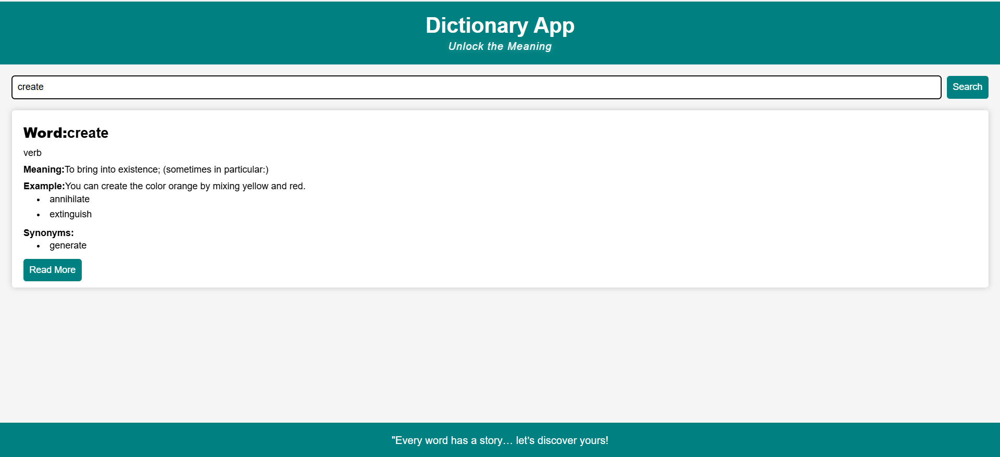

# 📚 Dictionary App — *Unlock the Power of Words*

A clean and responsive **Dictionary App** built using **HTML, CSS, and JavaScript**, powered by the [Free Dictionary API](https://dictionaryapi.dev/) to fetch accurate meanings, synonyms, antonyms, and pronunciations in real time.  

---

## 🚀 Features
- 🔍 **Instant Word Search** – Get results instantly  
- 📖 **Accurate Meanings** with multiple definitions  
- 📝 **Synonyms & Antonyms** (for better vocabulary)  
- 📱 **Responsive Design** – Works on all devices  
- 🎨 **Simple & Elegant UI**  

---

## 🛠️ Tech Stack
- **HTML5** – Structure of the app  
- **CSS3** – Styling and responsive design  
- **JavaScript (Vanilla)** – Logic & API handling  
- **Free Dictionary API** – Data source  

---

## 📷 Preview  

---

💡 What I Learned

- Through this mini project, I learned:
- How to fetch and process data from an API
- How to dynamically update the DOM using JavaScript
- How to build a responsive & user-friendly UI
